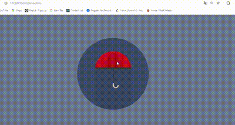

# Umbrella Animation using HTML and CSS

This project demonstrates a simple animated umbrella using HTML and CSS. The umbrella can open and close when clicked, simulating a rainy day.

## Getting Started

### Prerequisites

- A modern web browser that supports CSS animations.

### Running the Animation

1. Save the `index.html` and `style.css` files to your local machine.
2. Open the `index.html` file in your web browser.

## Features

- Animated umbrella that opens and closes when clicked.
- Simulates a rainy day environment using CSS.

## HTML Structure

- The HTML file contains a `div` with the class `container` that holds the umbrella.
- The umbrella is represented by a `div` with the class `umbrella` and additional elements for the stick and panels.

## CSS Styling

- The `style.css` file includes styles for the umbrella and its components.
- CSS animations are used to create the opening and closing effect of the umbrella.
- The background simulates a rainy day with a dark, cloudy color scheme.

## How to Use

1. Open the `index.html` file in your web browser.
2. Click on the umbrella to open and close it.

## Notes

- Ensure the `style.css` file is located in the same directory as the `index.html` file for proper functionality and styling.

Enjoy the interactive umbrella animation!

### Out put Screen

#### Umbrella Up and Down
